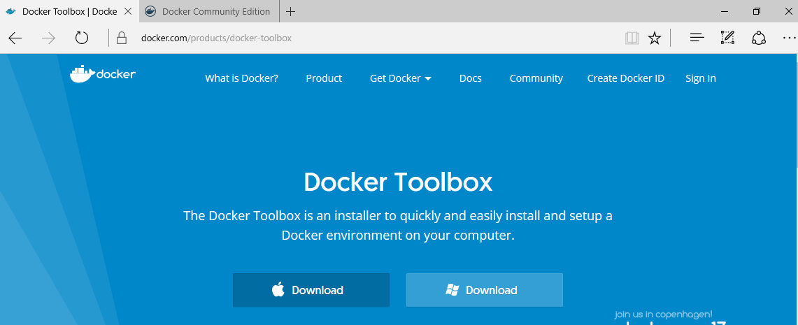
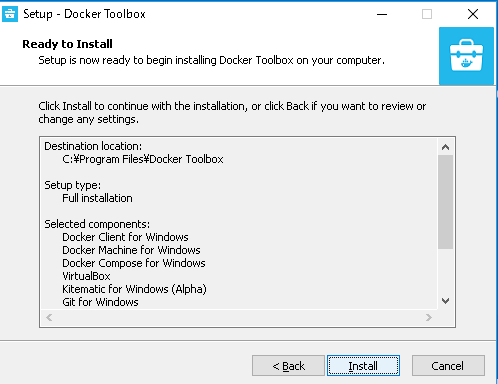
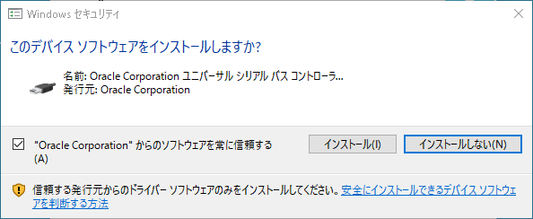
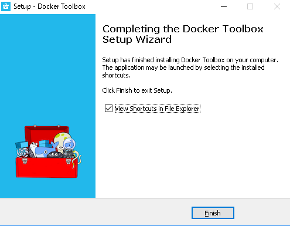
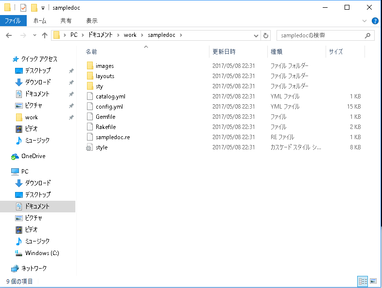
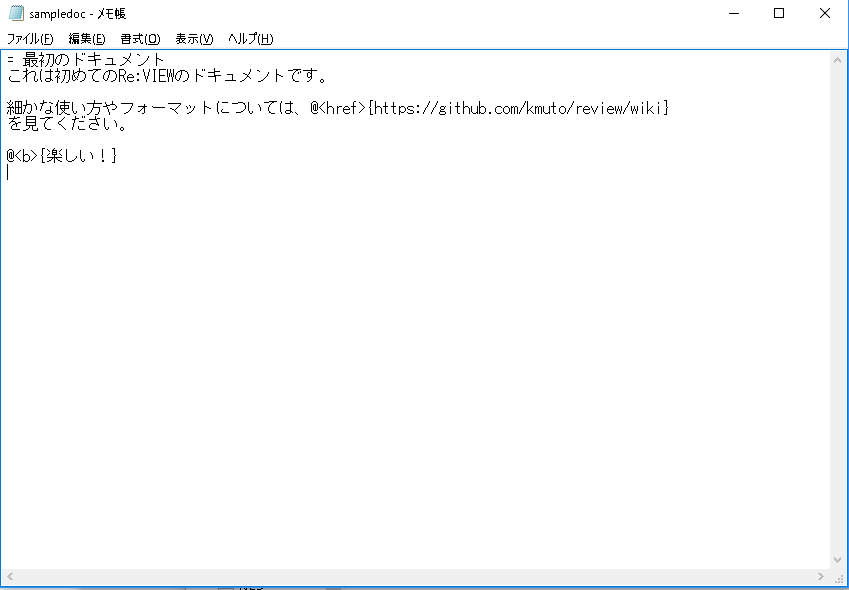
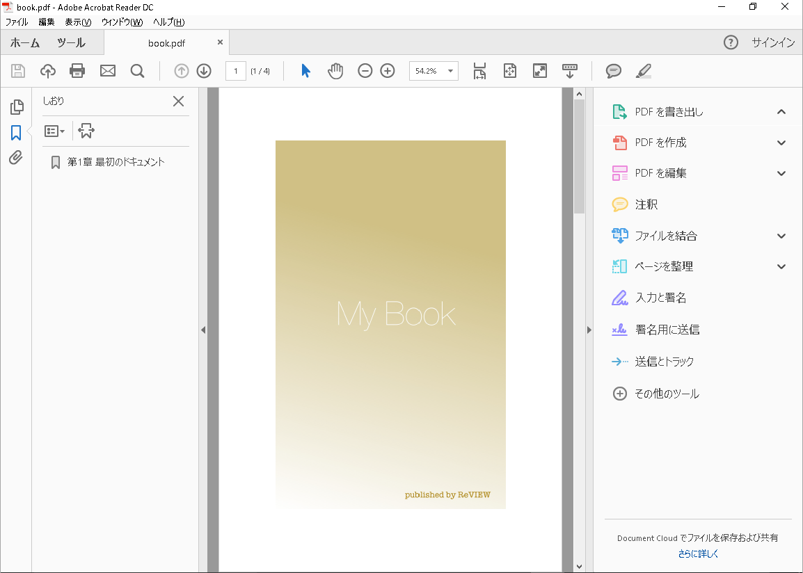
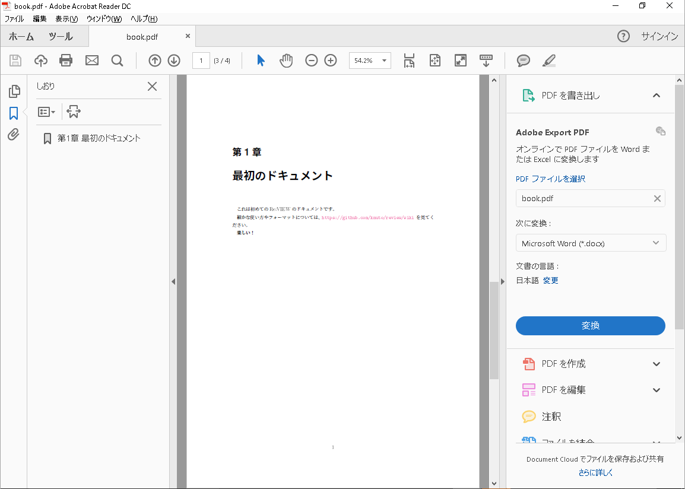
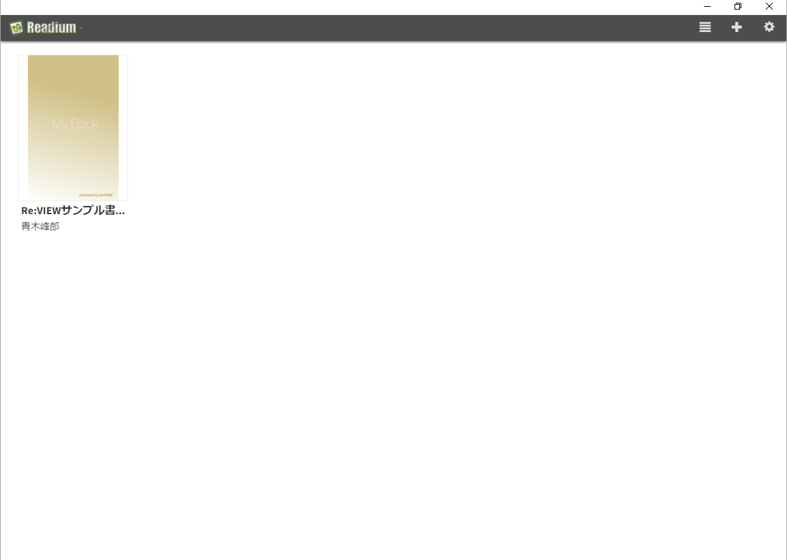
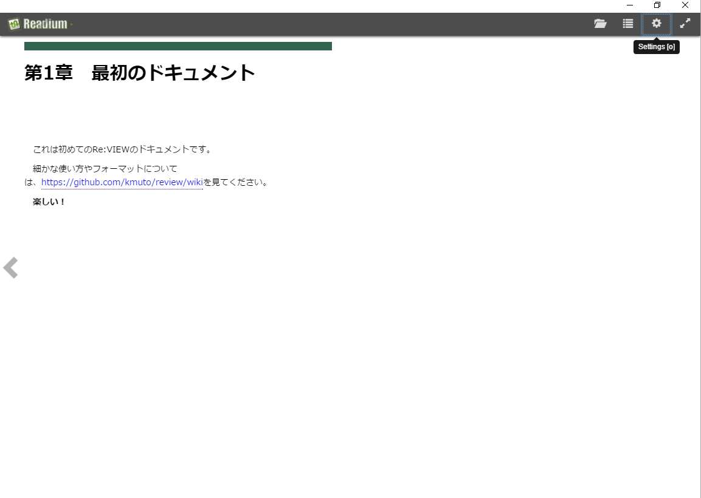

# WindowsでDocker+Re:VIEWを使う

本ドキュメントでは、Windows上で「Re:VIEW image for Docker」を利用し、Re:VIEWドキュメントからPDFおよびEPUBを生成する方法を紹介します。

## 必要なもの
* **Microsoft Windows**。本ドキュメントはWindows 10 Homeエディションに基づいています。
* **ストレージ内に最低でも2GB以上の空き領域**。Re:VIEW image for Dockerをインストールすると1.98GBを使用します。このほかにDockerToolboxなどのツール、ドキュメント自体などを収納するための空き領域も必要です。
* **UTF-8を扱うことのできるテキストエディタ**。「メモ帳」アプリでもUTF-8形式での保存は可能ですが、実際にドキュメントを執筆・編集するにあたってはより適切で高機能なテキストエディタが必要になるでしょう。Atom、Emacs、秀丸など向けにRe:VIEWをサポートする外部拡張が公開されています（[https://github.com/kmuto/review/wiki](https://github.com/kmuto/review/wiki)）。

## Dockerのセットアップ
**Docker**は、OSと特定用途のアプリケーションをまとめて「コンテナ」という形にし、それを必要に応じて簡単に呼び出すことができるサービスです。たとえば、Re:VIEW image for DockerはLinux（Ubuntu Linux）とRe:VIEWの動作環境をコンテナ化したものです。Re:VIEWやそれを取り巻くRubyやTeXLiveといった個々のソフトウェアをWindowsにセットアップしようとするとそれだけでもとても面倒な作業ですが、Dockerを使えばそのようなことにわずらわされることなく、すべて揃った状態からRe:VIEWのドキュメント制作を始めることができます。

Windows向けのDockerには、[Docker for Windows](https://docker.com/docker-windows)と[Docker Toolbox](https://docker.com/products/docker-toolbox)という2種類の実装があります。どちらもDockerの開発元であるDocker, Inc.社公式のものですが、前者はWindowsの仮想化支援技術Hyper-Vを利用していて動作も高速なのに対し、後者はVirtualBoxというDockerを動かすためにはオーバーヘッドの大きい仮想化ソフトウェアの上に乗っています。

本来は前者をお勧めしたいところですが、Docker for WindowsにはProfessional以上のWindowsエディションでなければ動作しないという制約があります。一般的な家庭用PCではHomeエディションが使われていると思いますので、本ドキュメントでは後者のDocker Toolboxに基づいて説明します（Docker for Windowsを使える環境にある方は、ぜひそちらを試してみてください）。

まず、[https://docker.com/products/docker-toolbox](https://docker.com/products/docker-toolbox)からDocker Toolboxをダウンロードします。macOS版とWindows版がありますが、Windowsマークのあるほうをダウンロードしましょう。



ダウンロードした「DockerToolbox.exe」を実行します。Windowsインストール向けの署名がないようで「この不明な発行元からのアプリがデバイスに変更を加えることを許可しますか?」というダイアログが出るかもしれません。［はい］を押して先に進みます。

セットアップウィザードのダイアログが表示されます。


基本的にそのまま［Next>］をクリックしていくだけでよいでしょう。

* 「Help Docker improve Toolbox.」: Docker社がインストール障害などの情報を収集することの可否。絶対に嫌であればチェックを外す。
* 「Setup will install Docker Toolbox into the following folder.」： Dockerプログラムのインストール先フォルダ。
* 「Select Components」: インストールするDockerコンポーネントの選択。下手にいじるとDockerが正常に動かなくなる可能性のほうが高い。
* 「Select Additional Tasks」: デスクトップショートカットやパスの追加など。あえて変える必要はないはず。「Install VirtualBox with NDIS5 driver」もチェックを外したままでよい。

［Install］を選び、インストールを実行します。



途中、VirtualBoxのハードウェアドライバのインストールを要求されるので、ダイアログに従って「インストール」をクリックして進めていきます。



セットアップが終わったら［Finish］ボタンを押して閉じます。



エクスプローラでDockerプログラムのウィンドウが開かれている（スタートメニューにも登録されています）ので、「Docker Quickstart Terminal」を実行します。Dockerサービスが起動し、Dockerのイメージキャラクタであるクジラと、シンプルなコマンドプロンプトが提示されます。以降、このコマンドプロンプトの画面を便宜上「Dockerターミナル」と呼ぶことにします。最初の起動では、途中でVirtualBox Interfaceのデバイス変更許可を求められるかもしれません。その場合は［はい］を押して許可してください。


これでDocker自体のセットアップは完了です。

## Re:VIEW image for Dockerの展開
続いて、Re:VIEW image for Dockerを利用するための設定に進みます。

ここでは「ドキュメント」フォルダに「work」というサブフォルダを用意して、その中で各Re:VIEWドキュメントフォルダを管理するという想定で進めます。

```
PC
└─ドキュメント
    └─work
        ├─Dockerfile
        ├─docker-compose.yml
        ├─sampledoc
        │  ├─sampledoc.re
        │  └……
        └……
```

エクスプローラでworkフォルダを作ったら、次の2つのファイル「Dockerfile」「docker-compose.yml」をテキストエディタを使って作成し、workフォルダ内に配置します（メモ帳で作成した場合は拡張子`.txt`となっているのをエクスプローラで修正してください）。

Dockerfile
```
FROM vvakame/review
```

docker-compose.yml
```
version: '2'
services:
  review:
    volumes:
      - .:/work
    build: .

networks:
  default:
    external:
      name: bridge
```

docker-compose.ymlの行頭インデントの違いは重要です。本ドキュメントからコピーペーストして使ってもよいでしょう。

次にDockerターミナルで操作します。WindowsのGUIに慣れているとおどろおどろしいDockerターミナルですが、実際利用するコマンドの数はさほど多くはありません。このDockerターミナルはMinGWという小さなUnix互換環境になっており、Unixの一般的なコマンドを利用できます。

まず、作成したworkフォルダに移動します。次のように入力し、Enterを押します。

```
cd ~/Documents/work
```

次に、Dockerコンテナの元となる「Dockerイメージ」をダウンロードします。同様に次のように入力してEnterを押してください。

```
docker pull vvakame/review
```

このダウンロードと展開にはかなり時間がかかりますが、安定したネットワーク環境であれば特に問題なく終了するでしょう。


これでWindowsでRe:VIEWを利用する準備は完了です！

## Docker+Re:VIEWドキュメント制作
workフォルダ内（`cd ~/Documents/work`をした状態）で、docker-composeコマンドを使ってRe:VIEWの各コマンドを呼び出せます。

review-initコマンドはRe:VIEWドキュメントの雛型を作るコマンドです。新規に「sampledoc」を作ってみましょう。Docker経由で呼び出すには、Dockerターミナルで次のように実行します。

```
docker-compose run --rm -w //work review review-init sampledoc
```

* 「docker-compose」は「docker-compose.exe」としても構いません。「docker-」と入力してTabキーを押せば補完されるでしょう。
* 「run」はDockerコンテナで指定のコマンドを実行して終了する、という指令です。
* 「--rm」はコマンド終了後にコンテナを削除するオプションです。DockerコンテナはDockerイメージから複製されるものなので、目的のコマンド実行を終えたら削除してしまっても問題ありません。
* 「-w //work」はコンテナ内での作業フォルダを指定します。少々ややこしいのですが、この「/work」はDocuments\workのことではなく、docker-compose.ymlのvolumesパラメータで設定した「.:/work」、つまり「.（docker-compose.ymlのあるフォルダ）＝コンテナ内での/workフォルダ」と紐付けられた/workです。なお、本来の「/work」ではなく「//work」としているのは、MinGWの制約によるものです。
* 「review」が使用するDockerイメージとなります。
* 「review-init sampledoc」がDockerコンテナの上で実行されるRe:VIEWコマンドです。sampledocという名前の新規フォルダを作業フォルダ（work）内に作り、Re:VIEWドキュメントに必要な初期ファイル群を展開します。

展開されたsampledocフォルダ内は次のようになっています。



この中の各ファイルについての詳細は、[Re:VIEW Quick Start Guide](https://github.com/kmuto/review/blob/master/doc/quickstart.ja.md)や[Re:VIEW Format Guide](https://github.com/kmuto/review/blob/master/doc/format.ja.md)、その他[https://github.com/kmuto/review/wiki](https://github.com/kmuto/review/wiki)にある各ドキュメントを参照してください。

ひとまず、コンテンツを書き込むsampledoc.reファイルに、テキストエディタを利用して適当なテキストを書き込んでみることにします。



ここではメモ帳を使っていますが、冒頭で述べたとおり、より適切なテキストエディタを使ったほうがよいでしょう。また、保存時には文字エンコーディングを「UTF-8」にしておく必要があります。

PDFを生成するには、次のようにDockerターミナルで実行します。

```
docker-compose run --rm -w //work/sampledoc review rake pdf
```

今度はsampledocフォルダ内に対して実行するので「-w //work」ではなく「-w //work/sampledoc」としていることに注意してください。「rake pdf」がPDFを生成するコマンドです（内部では`review-pdfmaker config.yml`というRe:VIEWコマンドが呼び出されています）。

sampledoc.reにエラーがなければ、sampledocフォルダにbook.pdfというPDFファイルが生成されます。

[Acrobat Reader](https://get.adobe.com/jp/reader/)でPDFを開いてみます。





EPUBを生成するのもほぼ同じで、次のようにDockerターミナルで実行します。「rake epub」がEPUBを生成するコマンドです（内部では`review-epubmaker config.yml`が呼び出されます）。

```
docker-compose run --rm -w //work/sampledoc review rake epub
```

book.epubというEPUBファイルが生成されるので、Google Chromeブラウザの拡張機能である[Readium](http://readium.org/)でこのファイルを開いてみます。





このように、同じコンテンツからPDFとEPUBという2つの形式のファイルを作成できました！

## その他のコマンド
docker-composeコマンドの詳細については、[https://docs.docker.com/compose/](https://docs.docker.com/compose/)などを参照してください。

* docker-compose ps: 実行/停止中のDockerコンテナを一覧する
* docker-compose rm *コンテナID*: Dockerコンテナを削除する
* docker-compose images: Dockerイメージを一覧する
* docker-compose pull: Dockerイメージを更新する
